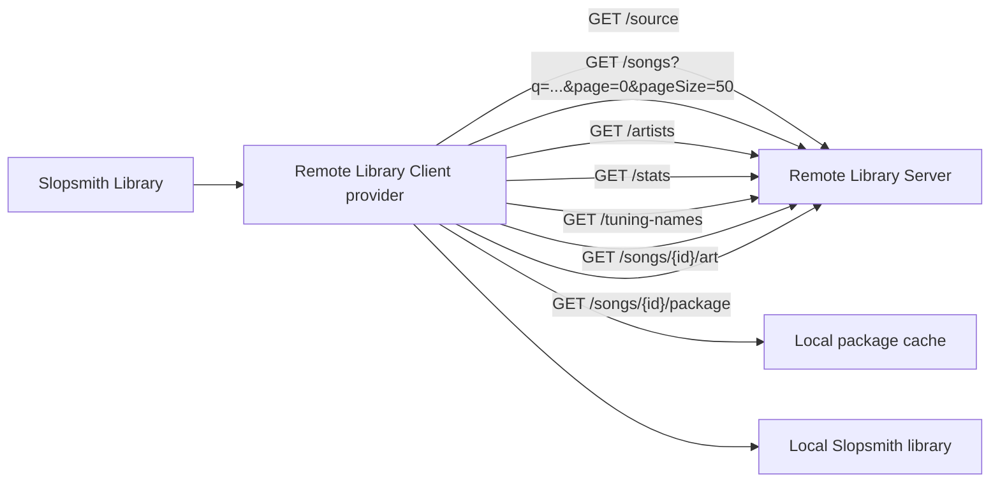

# Slopsmith Remote Library Client

Remote Library Client connects Slopsmith to one or more direct Remote Library Server URLs. Each configured server is registered as a Slopsmith library provider, so it appears in the core Library source selector.

## Flow



## Usage

1. Install the Remote Library Server plugin on the machine that owns the library.
2. Start that server on its own port.
3. Install this client plugin on the browsing machine.
4. Open **Remote Client** and add the server base URL, such as `studio.local`, `http://127.0.0.1:8765`, or `http://192.168.1.X:8765`. If you omit the protocol or port, the client tries `http` and then `https` on port `8765`.
5. Open the main Library screen and choose the remote source from the source selector.
6. Click a remote song to load it into the local library cache and play it.

## Development

```bash
pytest
ruff check .
node --check screen.js
```